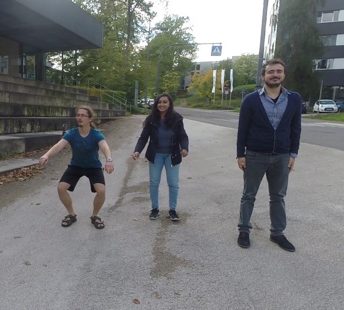
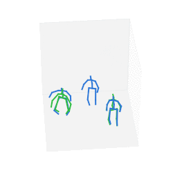

# Multi-Person Absolute 3D Human Pose Estimation with Weak Depth Supervision

 

This repo contains the code for the paper [Multi-Person Absolute 3D Human Pose Estimation with Weak Depth Supervision](https://arxiv.org/pdf/2004.03989.pdf).

## Prerequisites
The model uses the following packages:
* PyTorch 1.1.0
* Torchvision 0.2.2
* OpenCV 3.4.3 (should work with newer versions as well)
* numpy

## Evaluating on MuPotS-3D
To reproduce the results in the paper, first download the MuPoTS-3D dataset. You'll also need the preprocessed [data and model](https://drive.google.com/file/d/1azqyC3mnryVMm9rbHFcAlk9ERBl13aOR/view?usp=sharing). Extract the downloaded zip in the root folder of the repository. To evaluate the pretrained model, use the following command:  
``MUPOTS_FOLDER=<path/to/mupots> python3 scripts/eval.py normalized``  
The above command evaluates the performance of the model trained on normalized MuCo coordinates (see paper for more info). You can swap `normalized` to `unnormalized` to evaluate the model trained on the unnormalized coordinates.

## Running on new images
You can run the model on new images for which no preprocessed data exists. For that you'll also need Mask-RCNN and HR-net installed:

1. Install [Detectron](https://github.com/facebookresearch/Detectron)
2. Install [HR-net](https://github.com/leoxiaobin/deep-high-resolution-net.pytorch)
3. Download the pretraiend MegaDepth model:  
``wget -O best_generalization_net_G.pth http://www.cs.cornell.edu/projects/megadepth/dataset/models/best_generalization_net_G.pth``
4. Add the focal length and prinicipal point coordinates to metadata.csv (see `examples/metada.csv` for an example). The former can be found in the camera specifications, for the latter the center of the image is a good approximation.
5. Edit the `predict.sh` script to include the root location of Detectron and HR-net. You might also want to activate/deactivate necessary Python virtualenvs around Detectron or HR-net.
6. Run the prediction script:  
`./predict.sh examples/imgs examples/metadata.csv`  
The output is saved in results.pkl.
